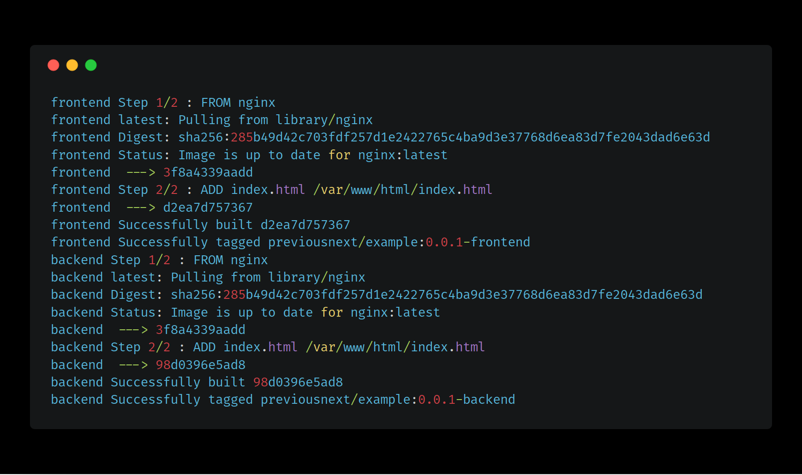

Packager
========

A library for packaging applications into containers.

This project will:

* Build
* Push

## Example Implementation

An implementation can be found the in the `example` directory.

This is a simple application which takes an `images.yml` file and builds them.
